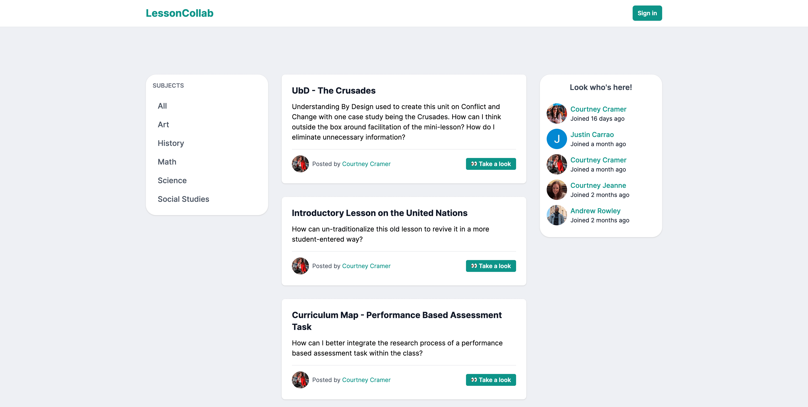

# LessonCollab

A collaborative platform for educators to improve their lesson plans with feedback from their peers.

## Table of contents

- [Introduction](#introduction)
- [Technology](#technology)
- [Features](#features)
- [Roadmap](#roadmap)
- [Visit LessonCollab](#visit-lessoncollab)
- [Let's Connect](#lets-connect)

## Introduction

LessonCollab is a valuable platform designed to empower educators. It enables them to upload their lesson plans, receive constructive feedback from fellow educators, and implement the suggested improvements at their discretion. Additionally, LessonCollab fosters collaboration by providing an opportunity for educators to learn from each other's feedback and integrate valuable insights into their own lessons. By promoting knowledge sharing and continuous improvement, LessonCollab empowers educators to enhance the quality of their teaching materials and create more impactful learning experiences.

## Technology

### Next.js

- Next.js is a versatile React framework that powers LessonCollab, enabling us to deliver a seamless and performant user experience. With Next.js, the LessonCollab platform benefits from efficient rendering, server-side rendering capabilities, and dynamic routing.

### Supabase

- Supabase is a PostgreSQL database-as-a-service, to provide a robust and scalable backend infrastructure. Supabase ensures secure data storage, real-time updates, and easy integration with the frontend.

### React Hook Form

- LessonCollab takes advantage of React Hook Form, a lightweight and flexible form library, to simplify and streamline the process of form data handling within the app.

### Formidable

- Formidable is a powerful tool that streamlines file transfers from the front end to the back end of LessonCollab. With Formidable, handling file uploads becomes effortless, allowing LessonCollab to securely push files to cloud-based storage while efficiently storing relevant file information in the database.

## Features

### OAuth for Easy Sign-In

- Enjoy a seamless and hassle-free sign-in experience with OAuth authentication. Say goodbye to passwords and effortlessly join LessonCollab. Currently authenticating with Google to streamline the registration process.

### Secure and Protected Routes

- Security is ensured with authentication-based protected routes. LessonCollab safeguards access to sensitive pages, allowing only authenticated users to explore and interact with protected content.

### Dynamic Page Routing and Templating

- Experience dynamic and flexible navigation with our LessonCollab's page routing and templating system. Seamlessly switch between different sections and content, providing a consistent and user-friendly browsing experience.

### Protected API Routes with getServerSideProps

- Leverage Next.js' powerful `getServerSideProps` and Supabase authentication functions to protect your API routes. By authenticating requests at the server side, LessonCollab ensures that only authorized users can access and interact with sensitive APIs.

### Create, Read, Update, and Delete Lesson Posts

- LessonCollab allows educators to effortlessly create lesson posts, update them as needed, and remove outdated content.

## Roadmap

1.  **Bookmarking:**

    - Implement a bookmarking functionality that allows users to save and revisit lessons for future reference. This feature enhances user convenience and enables easy access to important content.

2.  **Comment Replies:**

- Enhance the commenting system to enable users to reply directly to specific comments. This promotes more focused and structured discussions, facilitating effective communication among users.

3.  **Flagging System:**

    - Introduce a flagging system that empowers the community to address content that may not align with community guidelines or purpose. Users can flag both comments and posts, ensuring a safe and constructive environment for everyone.

4.  **Improved PDF Viewing on iOS Mobile:**

    - Address the issue of PDFs displayed within iFrames on iOS mobile devices, particularly in Safari. Implement a solution that ensures the PDFs are fully viewable and scrollable, allowing a seamless and user-friendly experience for iOS users.

5.  **In-App Notifications:**

    - Stay connected and manage your interactions with other users seamlessly through our in-app notification system. Receive real-time notifications within the app, keeping you informed about important updates, messages, and interactions. With our intuitive interface, you can effortlessly engage with notifications, ensuring you never miss out on any meaningful conversations or opportunities for collaboration.

6.  **Direct Messages:**

    - Enhance your communication and collaboration with seamless one-on-one conversations within LessonCollab.

The roadmap outlines key features and enhancements to be implemented in the future development of the platform. These additions will enhance user engagement, promote a positive community experience, and optimize compatibility across different devices and browsers.

## Visit LessonCollab

[Visit LessonCollab today!](https://www.lessoncollab.com/)

## Let's Connect

- [Follow me on Twitter](https://twitter.com/_internetdrew_)
- [Let's connect on LinkedIn](https://www.linkedin.com/in/internetdrew/)
